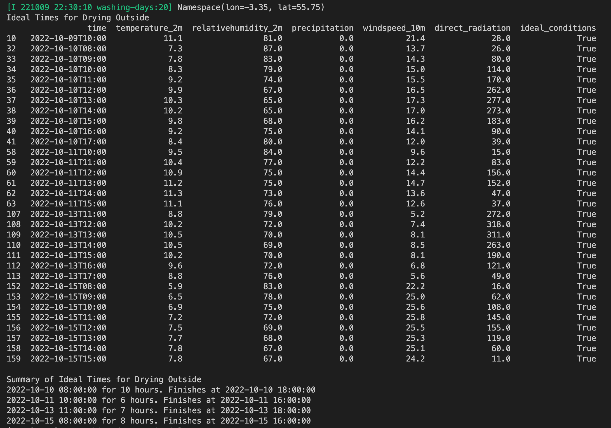

# Washing Days

Predicting the ideal times to dry clothes outside using meteorological data

# Live Demo

https://wshelley.github.io/washing-days.txt

Updating every hour.

# Example Usage:
```
pip3 install -r requirements.txt
python3 washing-days.py --lon -3.35 --lat 55.75
```
# Example Output:



### Intial Project Setup:
```
mkdir washing-days
cd washing-days
python3 -m venv venv
git init
```

```
source venv/bin/activate
Select Command Palete > Python > Select Interpreter ./venv/bin/python3.9
pip3 install -r requirements.txt
```
